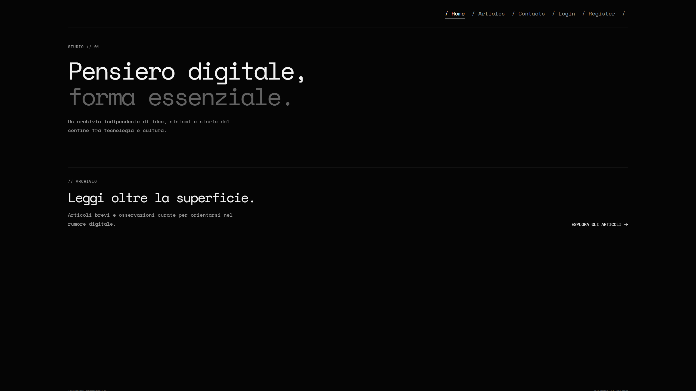
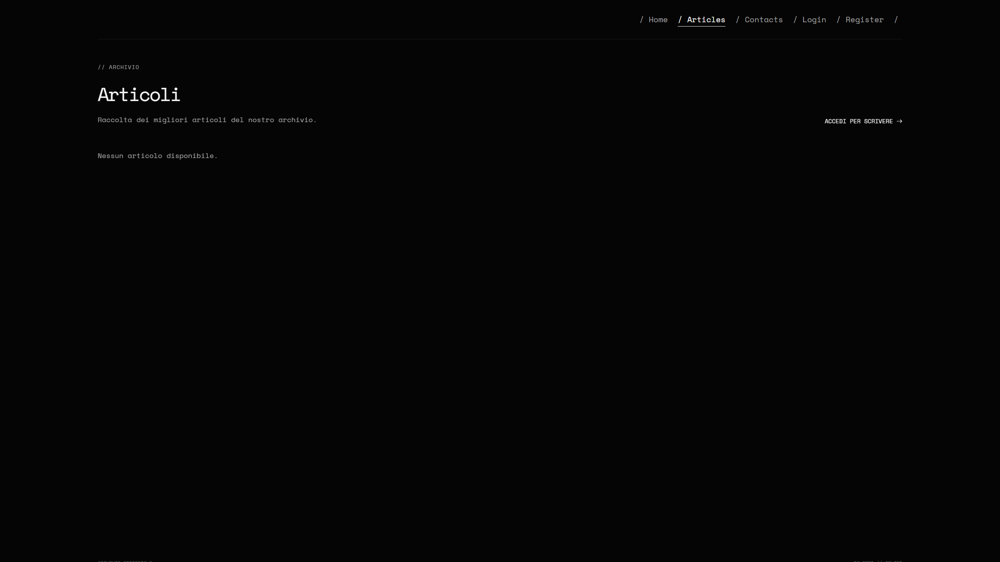
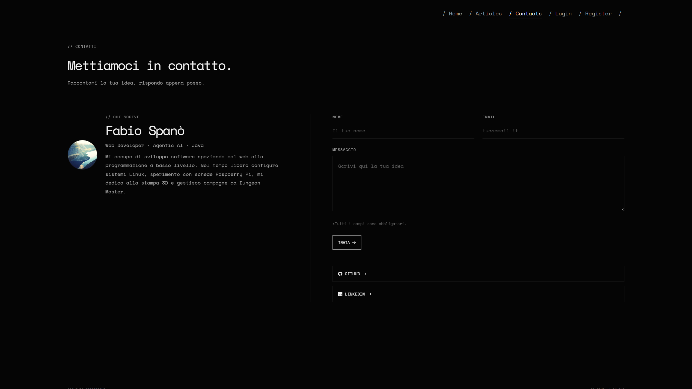
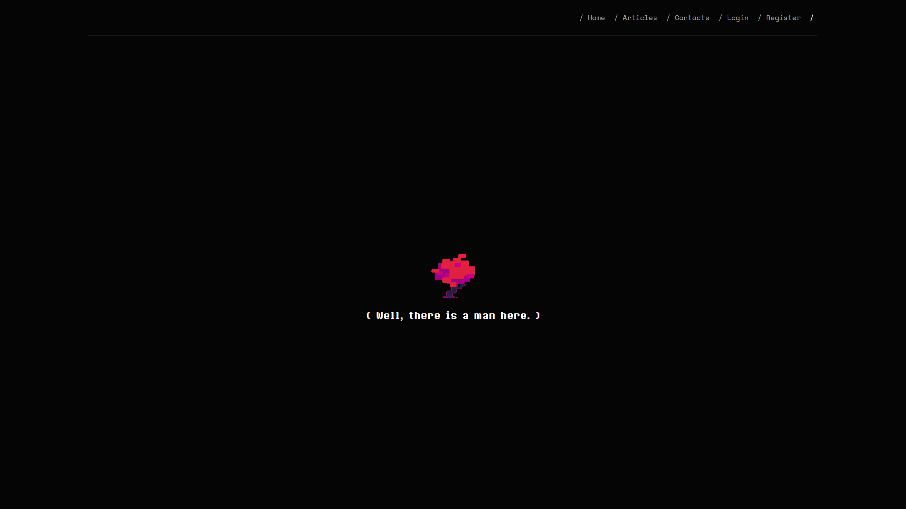

# blog-editoriale



Blog editoriale multi-pagina costruito attraverso un classico flusso server-side di richiesta/risposta: rotte definite con controller dedicati e contenuti renderizzati tramite template riutilizzabili con un layout condiviso. La sezione archivio elenca tutti gli articoli pubblicati e ogni articolo ha la propria pagina di dettaglio. La pubblicazione è riservata agli autori registrati: registrazione e login permettono di creare, modificare ed eliminare articoli, mentre l'area di scrittura è protetta e i visitatori possono solo leggere. Gli articoli vivono su un database dedicato e mantengono titolo, autore, categoria, contenuto e un'immagine opzionale caricata direttamente dall'editor. Una sezione contatti raccoglie i messaggi tramite un modulo validato che costruisce una mail di notifica consegnata al log locale durante lo sviluppo. Il flusso principale delle rotte è coperto da una suite di test automatici.

## Screenshots






## Installazione e avvio

```bash
composer setup
npm run dev
```

```bash
composer install
cp .env.example .env
php artisan key:generate
php artisan migrate
php artisan storage:link
npm install
npm run build
php artisan serve
```